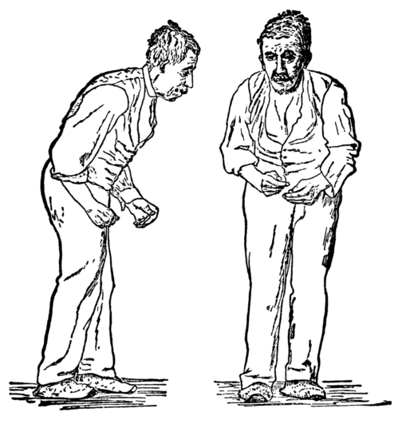

# ParkinsonDiseaseDetection

## What is Parkinson's Disease?

Parkinson's disease (PD), or simply Parkinson's, is a long-term degenerative disorder of the central nervous system that mainly affects the motor system. As the disease worsens, non-motor symptoms become more common. The symptoms usually emerge slowly. Early in the disease, the most obvious symptoms are shaking, rigidity, slowness of movement, and difficulty with walking. Thinking and behavioral problems may also occur. Dementia becomes common in the advanced stages of the disease. Depression and anxiety are also common, occurring in more than a third of people with PD. Other symptoms include sensory, sleep, and emotional problems. The main motor symptoms are collectively called "parkinsonism", or a "parkinsonian syndrome".

## Cause of the disease!

The cause of Parkinson's disease is unknown, but is believed to involve both genetic and environmental factors. Those with a family member affected are more likely to get the disease themselves.

* Genetics
* Environmental factors

Exposure to pesticides and a history of head injury have each been linked with Parkinson disease (PD), but the risks are modest. Never having smoked cigarettes, and never drinking caffeinated beverages, are also associated with small increases in risk of developing PD.
Low concentrations of urate in the blood serum is associated with an increased risk of PD.

