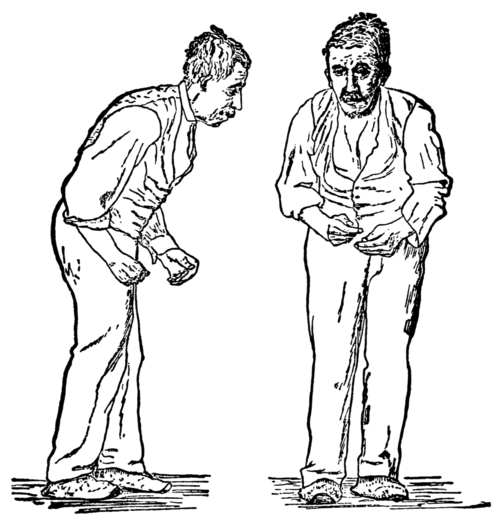
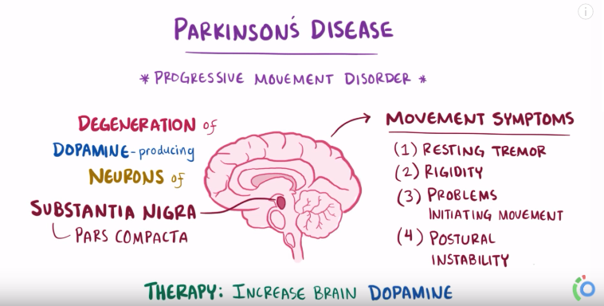

# ParkinsonDiseaseDetection

## What is Parkinson's Disease?

Parkinson's disease (PD), or simply Parkinson's, is a long-term degenerative disorder of the central nervous system that mainly affects the motor system. As the disease worsens, non-motor symptoms become more common. The symptoms usually emerge slowly. Early in the disease, the most obvious symptoms are shaking, rigidity, slowness of movement, and difficulty with walking. Thinking and behavioral problems may also occur. Dementia becomes common in the advanced stages of the disease. Depression and anxiety are also common, occurring in more than a third of people with PD. Other symptoms include sensory, sleep, and emotional problems. The main motor symptoms are collectively called "parkinsonism", or a "parkinsonian syndrome".

## Cause of the disease!

The cause of Parkinson's disease is unknown, but is believed to involve both genetic and environmental factors. Those with a family member affected are more likely to get the disease themselves.

* Genetics
* Environmental factors

Exposure to pesticides and a history of head injury have each been linked with Parkinson disease (PD), but the risks are modest. Never having smoked cigarettes, and never drinking caffeinated beverages, are also associated with small increases in risk of developing PD.
Low concentrations of urate in the blood serum is associated with an increased risk of PD.

## Applied Machine Learning in Healthcare.

Machine learning in medicine has recently made headlines. Google has developed a machine learning algorithm to help identify cancerous tumors on mammograms. Stanford is using a deep learning algorithm to identify skin cancer. A recent JAMA article reported the results of a deep machine-learning algorithm that was able to diagnose diabetic retinopathy in retinal images. It’s clear that machine learning puts another arrow in the quiver of clinical decision making.

Still, machine learning lends itself to some processes better than others. Algorithms can provide immediate benefit to disciplines with processes that are reproducible or standardized. Also, those with large image datasets, such as radiology, cardiology, and pathology, are strong candidates. Machine learning can be trained to look at images, identify abnormalities, and point to areas that need attention, thus improving the accuracy of all these processes. Long term, machine learning will benefit the family practitioner or internist at the bedside. Machine learning can offer an objective opinion to improve efficiency, reliability, and accuracy.

## Data Drives Machine Learning.

As more data is available, we have better information to provide patients. Predictive algorithms and machine learning can give us a better predictive model of mortality that doctors can use to educate patients.

But machine learning needs a certain amount of data to generate an effective algorithm. Much of machine learning will initially come from organizations with big datasets. Health Catalyst is developing Collective Analytics for Excellence (CAFÉ™), an application built on a national de-identified repository of healthcare data from enterprise data warehouses (EDWs) and third-party data sources. It is enabling comparative effectiveness, research, and producing unique, powerful machine learning algorithms. CAFÉ provides a collaboration among our healthcare system partners, big and small.

As larger datasets begin to run machine learning, we can improve care in more specific ways for each region. And considering rare diseases with low data volumes, it should be possible to merge regional data into national sets to scale the volume needed for machine learning.

## What is XGBoost?

XGBoost is a new Machine Learning algorithm designed with speed and performance in mind. XGBoost stands for eXtreme Gradient Boosting and is based on decision trees. In this project, we will import the XGBClassifier from the xgboost library; this is an implementation of the scikit-learn API for XGBoost classification.

&copy;HR